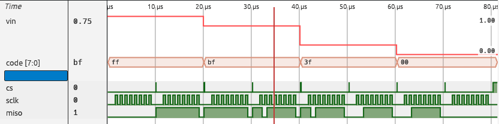
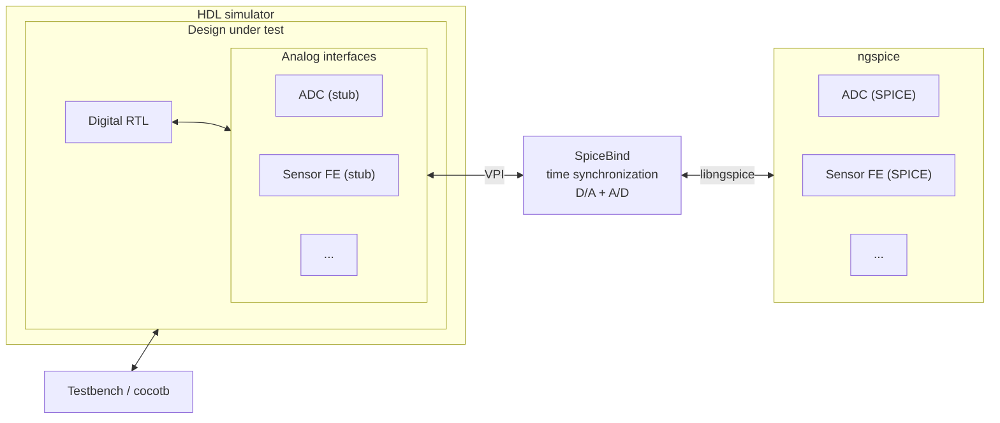

# SpiceBind

SPICE circuits inside an HDL simulation.

[](https://github.com/themperek/spicebind/actions/workflows/tests.yml)
[](https://themperek.github.io/spicebind/)
[](https://pypi.org/project/spicebind/)
[](LICENSE)

SpiceBind embeds [ngspice](https://ngspice.sourceforge.io/) into a VPI-capable Verilog simulator. Selected HDL module instances can be backed by SPICE circuits while the rest of the RTL, testbench, and verification flow stays in the HDL simulator.

This is an HDL-first mixed-signal flow. It is intended for designs where most of the system is digital, but some blocks need circuit-level simulation.

> SpiceBind is currently tested with Icarus Verilog and ngspice. The VPI-based architecture is simulator-independent, but other VPI-capable simulators have not yet been qualified.




The `spi_adc` example above crosses the HDL/SPICE boundary in both directions. `vin` is passed from HDL into ngspice, the ADC code is calculated by the SPICE model, and HDL logic shifts the result out over SPI.

## Key Benefits

- **Keep your existing HDL flow**  
  RTL, testbenches, cocotb, and the rest of the digital simulation stay in the HDL simulator you already use. SpiceBind does not require moving the design into a new mixed-signal environment.

- **Zero vendor lock-in**  
  SpiceBind uses the standard VPI interface and is designed to work with any VPI-capable HDL simulator, open-source or commercial. The simulator can be changed without changing the RTL, testbench, or SpiceBind model structure. The current implementation is tested with Icarus Verilog; other simulators still need qualification.

- **Replace only the blocks that need SPICE**  
  Selected HDL instances can be backed by transistor-level or analog SPICE models while the rest of the design continues to run as normal RTL.

- **Bidirectional mixed-signal interaction**  
  Digital signals drive SPICE sources, while analog node values are converted back into HDL values.

- **Synchronized simulation time**  
  SpiceBind coordinates HDL events with ngspice adaptive timesteps, including digital events that occur inside an analog timestep.

## Why HDL-first?

A mixed-signal design is often mostly RTL with a small number of analog blocks. Moving the complete system into a SPICE-centric simulation environment can mean changing the testbench and the way the digital part is simulated.

SpiceBind takes the opposite approach: keep the HDL simulator as the top-level simulation environment and attach ngspice to selected module instances. Existing RTL and HDL or cocotb testbenches can stay where they are.

## Architecture



The HDL side sees a normal module instance. The module body itself may be empty. SpiceBind discovers the selected instance through VPI and connects its ports to sources and nodes in the SPICE circuit.

Digital-to-analog values are passed to ngspice through external voltage sources. Analog results are read back from ngspice and applied to the corresponding HDL outputs.

The two simulators have independent event and timestep mechanisms, so signal exchange alone is not enough. SpiceBind also synchronizes simulation time. VPI callbacks detect HDL events, ngspice callbacks report analog progress, and a time barrier prevents either engine from running ahead. If an HDL event occurs inside an ngspice step, SpiceBind can request that the SPICE step is redone at the event time.

More detail is available in the [timing synchronization documentation](https://themperek.github.io/spicebind/).

## Quick start

### Requirements

- C++17 compiler (needed to build the VPI plugin)
- ngspice shared library and development headers
- Verilog VPI compatible simulator (tested with [Icarus Verilog](https://github.com/steveicarus/iverilog))
- Python 3.10+

Install the released package:

```bash
pip install spicebind
```

This builds the VPI plugin and installs the `spicebind-vpi-path` command.

If ngspice is not on `PATH`, point CMake at its install prefix (`include/` and `lib/`):

```bash
NGSPICE_ROOT=/path/to/ngspice pip install spicebind
```

For development:

```bash
git clone https://github.com/themperek/spicebind.git
cd spicebind
pip install -e ".[dev]"
```

Standalone VPI build (no Python package):

```bash
cmake -S . -B build  # optional: -DNGSPICE_ROOT=/path/to/ngspice
cmake --build build
cmake --build build --target debug  # Optional: debug VPI
```

Run the SPI ADC example:

```bash
python examples/spi_adc/test_spi_adc.py
```

## Binding an HDL instance to SPICE

The HDL contains a module with the interface that the rest of the design expects:

```verilog
module adc_core(
    input  real      vin,
    output     [7:0] code,
    input             range0,
    input             range1
);
    // implemented in SPICE
endmodule
```

The corresponding SPICE netlist provides external sources for HDL inputs and nodes for HDL outputs:

```spice
Vvin    vin    0 0 external
Vrange0 range0 0 0 external
Vrange1 range1 0 0 external

* Analog implementation
Xadc vin ref vcc code[7] code[6] code[5] code[4] code[3] code[2] code[1] code[0] adc_ideal_8bit

.tran 1ns 100us
.end
```

At runtime, select the netlist and HDL instance:

```bash
export SPICE_NETLIST=examples/spi_adc/spi_adc.cir
export HDL_INSTANCE=spi_adc.adc_inst
export VCC=3.3
```

The VPI module can then be loaded by the HDL simulator. For Icarus Verilog:

```bash
vvp -M "$(spicebind-vpi-path)" -m spicebind_vpi simulation.vvp
```

The examples use the cocotb runner or small shell scripts to set this up automatically.

## Runtime configuration

| Variable | Meaning |
| --- | --- |
| `SPICE_NETLIST` | Path to the ngspice netlist |
| `HDL_INSTANCE` | HDL instance path, or a comma-separated list of instance paths |
| `VCC` | Voltage used for digital-to-analog conversion. Default: `1.0` |
| `SPICE_DUMP_RAW` | Write ngspice transient data to `dump.raw` at shutdown |

## Examples

| Example | What it shows |
| --- | --- |
| [`examples/adc`](examples/adc) | 8-bit ADC with Verilog and cocotb testbenches |
| [`examples/adder_mos`](examples/adder_mos) | Four-bit CMOS adder derived from the ngspice MOS adder example |
| [`examples/spi_adc`](examples/spi_adc) | HDL SPI interface connected to an ADC implemented in SPICE |
| [`examples/serv_dco_calibration`](examples/serv_dco_calibration) | SERV firmware calibrates a transistor-level DCO through SpiceBind |

## How this differs from other open-source flows

There are several ways to combine HDL and SPICE. They differ mainly in which simulator owns the top level and how the digital part is executed.

| Approach | Top-level environment | Digital execution | Analog engine | Main characteristic |
| --- | --- | --- | --- | --- |
| SpiceBind | HDL simulator | Normal HDL simulation | ngspice shared library | Selected HDL instances are replaced by SPICE while the existing HDL flow remains in place |
| ngspice `d_cosim` | ngspice / XSPICE | HDL compiled with Verilator, Icarus Verilog, or GHDL and loaded as an XSPICE model | ngspice | SPICE-first flow with HDL blocks inside the ngspice netlist |
| Yosys to XSPICE | ngspice / XSPICE | Synthesizable RTL mapped to XSPICE gates and storage elements | ngspice | One simulator at runtime, but the RTL is reduced to synthesized logic |
| [`cocotbext-ams`](https://github.com/VLSIDA/cocotbext-ams) | cocotb / Python | Normal HDL simulator through cocotb | ngspice or Xyce | Python orchestrates the HDL and analog simulators |

These approaches are not interchangeable. A SPICE-first flow is a good fit when the analog netlist is naturally the top level. Synthesizing RTL into XSPICE avoids synchronizing two simulators at runtime. SpiceBind is aimed at the other case: a digital simulation already exists and only selected blocks need SPICE.

Commercial Verilog-AMS and real-number-modeling flows cover a broader set of use cases and are not compared here.

## Current scope

SpiceBind currently focuses on:

- ngspice as the analog engine
- Verilog through VPI
- Icarus Verilog as the tested HDL simulator
- binding selected HDL instances to SPICE
- event and timestep synchronization between HDL and ngspice
- cocotb compatibility, without requiring cocotb

The VPI architecture is not inherently tied to Icarus Verilog, but other HDL simulators have not yet been tested.

## Documentation

The full documentation contains tutorials, runtime configuration, API information, and a detailed description of the timing synchronization mechanism:

https://themperek.github.io/spicebind/

## Contributing

Bug reports, examples, and pull requests are welcome. Use the [GitHub issue tracker](https://github.com/themperek/spicebind/issues) for bugs, questions, and feature proposals.

## License

SpiceBind is distributed under the BSD 3-Clause License. See [LICENSE](LICENSE).

## Development note

SpiceBind is developed with assistance from generative AI tools.
All generated or modified code is reviewed, tested, and maintained
like any other contribution.