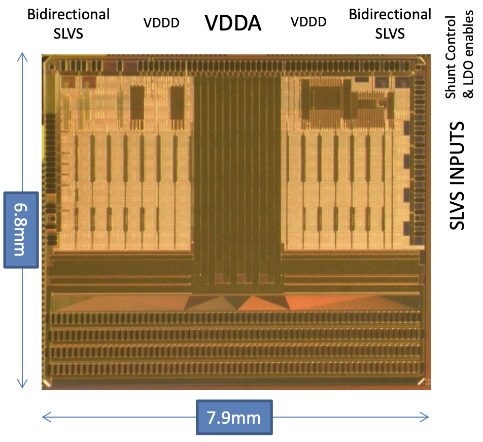
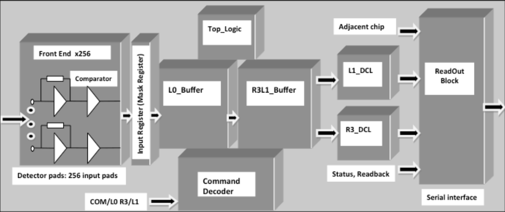
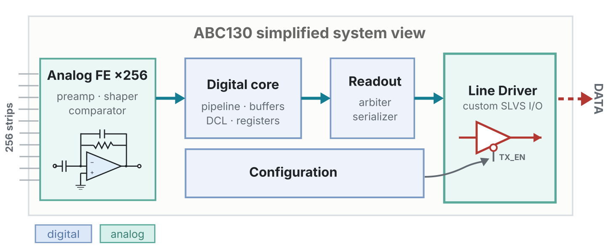
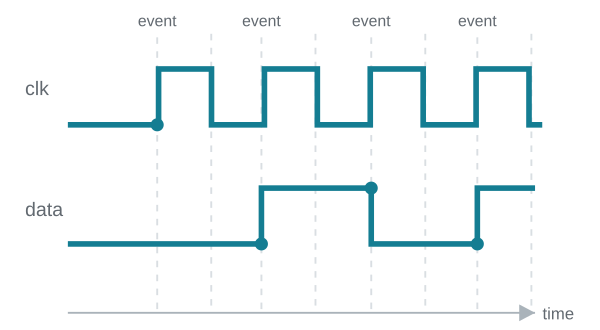
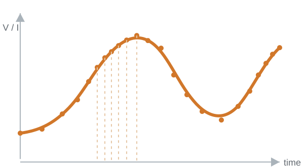
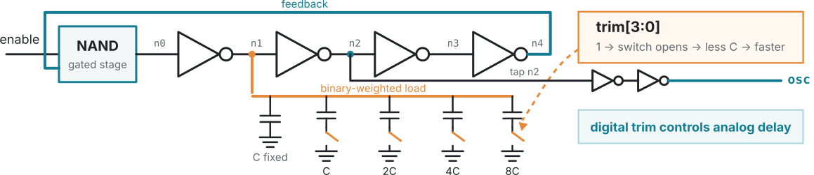
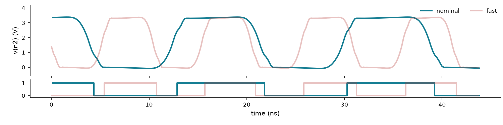
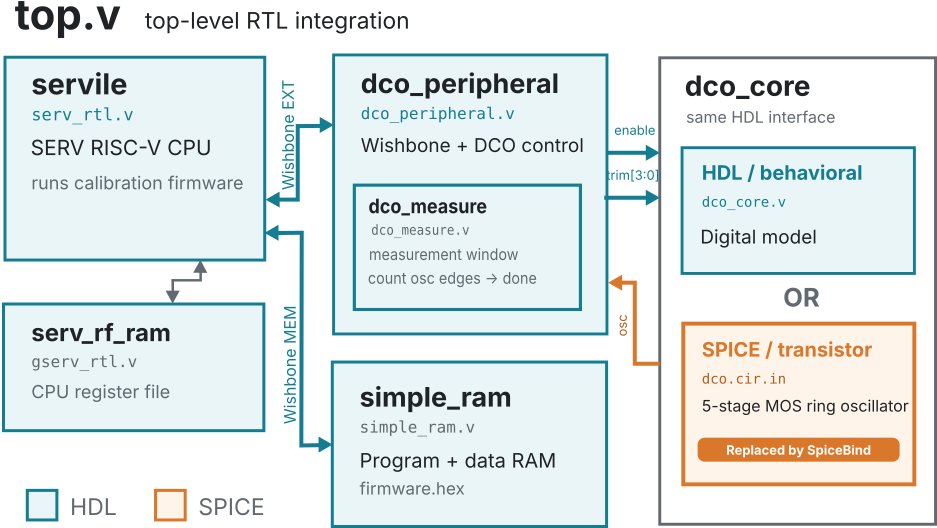
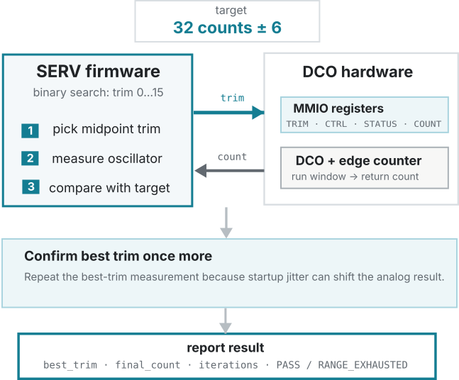
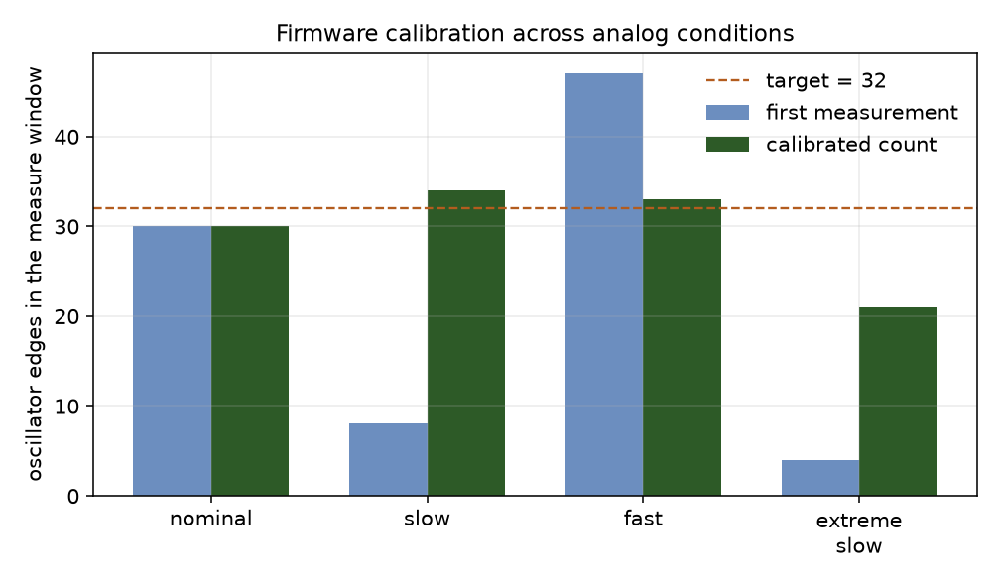

<!-- _class: lead -->
<!-- _paginate: false -->

# SpiceBind: Bringing SPICE into RTL Verification

 
Tomasz Hemperek

---

# ABC130: A strip readout ASIC for CERN

[Source: ACES 2014](https://indico.cern.ch/event/287628/contributions/1640935)

[Source: CERN CDS](https://cds.cern.ch/record/1494098)

  

  <ul>
    <li>Large mixed-signal ASIC for ATLAS at LHC</li>
    <li>256-channel analog front-end + substantial digital logic</li>
    <li>Extensive design reviews and verification</li>
  </ul>
  

<b>
 First silicon: no data on output 
</b>

---

# What went wrong?

  

    
  

  

    <h2>Failure symptom</h2>
    
<strong>No data output.</strong> The custom SLVS transceiver and its functional Verilog model disagreed on the polarity/meaning of the direction signal.

  

  

    <h2>Extensively verified chip</h2>
    
The chip had been extensively verified. The remaining gap was a <strong>mismatch between the functional model and the actual circuit.</strong>.

  

  <h2>How do we catch this class of bug?</h2>

- Verify across the abstraction boundary, not only inside each domain.
- Exercise the actual custom circuit from the existing digital testbench.
- <strong>Replace only the blocks that need circuit-level accuracy.</strong>

---

# Digital vs. analog simulation

  

    <h2>Digital</h2>
    

  

- Discrete logic states (0, 1, X, Z)
- Event-driven — advance to the next event
- Scales to large systems and long simulations

  

    <h2>Analog / SPICE</h2>
    

  

- Continuous-valued voltages and currents
- Adaptive timesteps + nonlinear circuit solves
- Device-level fidelity, but computationally expensive

<strong>The problem:</strong> <b>mixed-signal designs need both. Behavioral models make system simulation practical, but they can disagree with the actual circuit.</b>

--- 

# Open-source mixed-signal approaches

<table>
  <colgroup>
    <col><col><col><col>
  </colgroup>
  <thead>
    <tr>
      <th>Approach</th>
      <th>Top level</th>
      <th>Digital execution</th>
      <th>Main characteristic</th>
    </tr>
  </thead>
  <tbody>
    <tr class="focus">
      <td><strong>SpiceBind</strong></td>
      <td>HDL simulator</td>
      <td>Normal HDL simulation</td>
      <td>Selected HDL instances are replaced by SPICE.</td>
    </tr>
    <tr>
      <td>ngspice <code>d_cosim</code></td>
      <td>ngspice / XSPICE</td>
      <td>HDL compiled as an XSPICE model</td>
      <td>SPICE-first flow: HDL blocks live inside ngspice.</td>
    </tr>
    <tr>
      <td>Yosys → XSPICE</td>
      <td>ngspice / XSPICE</td>
      <td>RTL mapped to gates and storage elements</td>
      <td>Single runtime simulator; digital behavior is synthesized logic.</td>
    </tr>
    <tr>
      <td><a href="https://github.com/VLSIDA/cocotbext-ams">cocotbext-ams</a></td>
      <td>cocotb / Python</td>
      <td>Normal HDL simulator</td>
      <td>Python coordinates HDL and analog simulators such as ngspice or Xyce.</td>
    </tr>
  </tbody>
</table>

<strong>SpiceBind is HDL-first: </strong>keep the digital verification environment and use circuit-level simulation only for selected blocks.

* Commercial Verilog-AMS and real-number-modeling flows cover broader use cases; not compared here.

--- 

# SpiceBind

Keep digital simulator as the top level. Attach ngspice only to the blocks that need a real circuit.

 

  

    
Existing HDL flow

    

      
Testbenchcocotb / Verilog

      
↔

      
HDL simulatorRTL + empty analog shells

    

  

  
↔

  

    
VPI plugin

    
SpiceBindA/D · D/A · time sync

  

  
↔

  

    
Circuit

    
ngspiceselected instances only

  

  

  <h2>Empty module</h2>
  
The analog block is a Verilog shell. SpiceBind binds the instance; the netlist is the implementation.

  

  

  <h2>Ports by name</h2>
  
HDL inputs drive <code>Vname … external</code>. Outputs come back from <code>v(name)</code>. Names match after lowercasing.

  

  

  <h2>One timeline</h2>
  
If an HDL event lands inside a SPICE step, that step is redone.

  

--- 

# Where SpiceBind helps

 

<h2>Existing HDL flow</h2>

Keep RTL, testbench, cocotb, waveform flow, and regressions where they already are.

<h2>SPICE only where it matters</h2>

Run SPICE only for the instances where circuit behavior affects the system result.

<h2>Real mixed-signal checks</h2>

Write tests and sweeps around ADCs, PLLs, DCOs, sensor front-ends, bias loops, and custom I/O.

<h2>Open-source stack</h2>

Icarus Verilog, Verilator, ngspice, cocotb. Standard VPI, BSD-3-Clause. No vendor AMS simulator required.

---

# Example: DCO calibration

Digitally controlled oscillator: 5-stage ring oscillator + binary-weighted switched load

 

<b>Analog oscillation simulation for nominal and fast corners</b>

 

---

# Same RTL system, one replaceable block

  

    
  

  

    <h2>Same digital system</h2>
    
SERV CPU, RAM, Wishbone, and measurement logic remain normal RTL. The firmware runs unchanged.

  

  

    <h2>One replaceable block</h2>
    
<code>dco_core</code> keeps the same HDL interface: <code>enable</code>, <code>trim[3:0]</code>, <code>osc</code>. Use the behavioral model for fast runs or bind the SPICE circuit with SpiceBind.

  

<strong>Firmware, RTL and testbench stay unchanged.</strong> <b>Only the Digitally Controlled Oscillator implementation is replaced.</b>

---

# Firmware calibrates the circuit across corners

<b>Firmware calibration loop</b>

<b>Results before and after trimming across corners</b>

Behavioral

~1 s

SPICE

~50 s

* Generic BSIM3 demo models, not a foundry PDK; extracted PDK netlists can be significantly slower.

---

# SpiceBind: practical mixed-signal verification

<!-- 
Put real circuits into your existing HDL tests.
 -->

SpiceBind adds circuit-level simulation to selected blocks in an otherwise normal RTL verification flow.

<h2>Fits the existing RTL flow</h2>
<ul>
<li>Keep the RTL simulator as top level.</li>
<li>Use an empty Verilog shell.</li>
<li>Bind one instance to an ngspice.</li>
</ul>

<h2>Circuit-level checks in context</h2>
<ul>
<li>Use the existing digital verification environment.</li>
<li>Compare behavioral and SPICE implementations.</li>
<li>Exercise the circuit together with RTL and firmware.</li>
</ul>

<h2>Save engineering time and reduce respin risk</h2>
<ul>
<li>Catch model/circuit mismatches before silicon.</li>
<li>Debug mixed-signal behavior in regression.</li>
<li>Spend SPICE only where it matters.</li>
</ul>

 <strong>Early release — feedback and contributions welcome </strong>

<a href="https://github.com/themperek/spicebind" class="repo-big">
   themperek/spicebind
</a>

 

<a href="https://www.linkedin.com/in/hemperek/">
  
  linkedin.com/in/hemperek
</a>

Thanks for support to 

