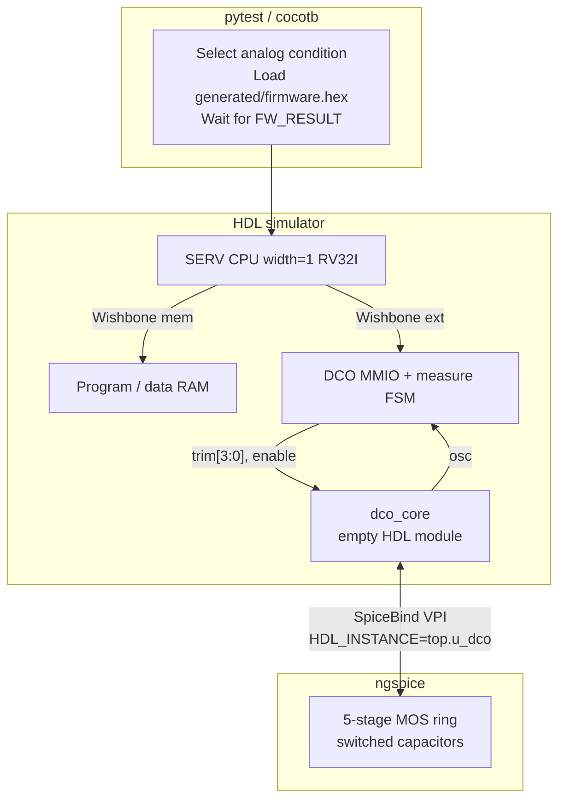
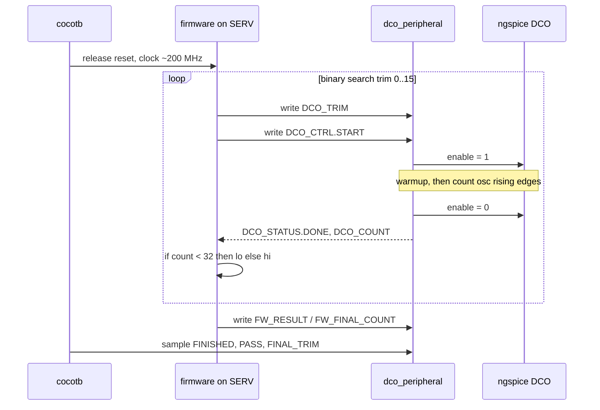
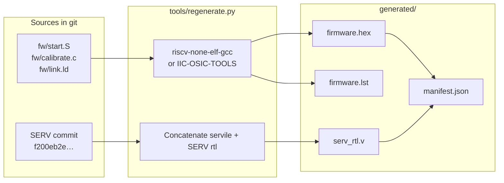
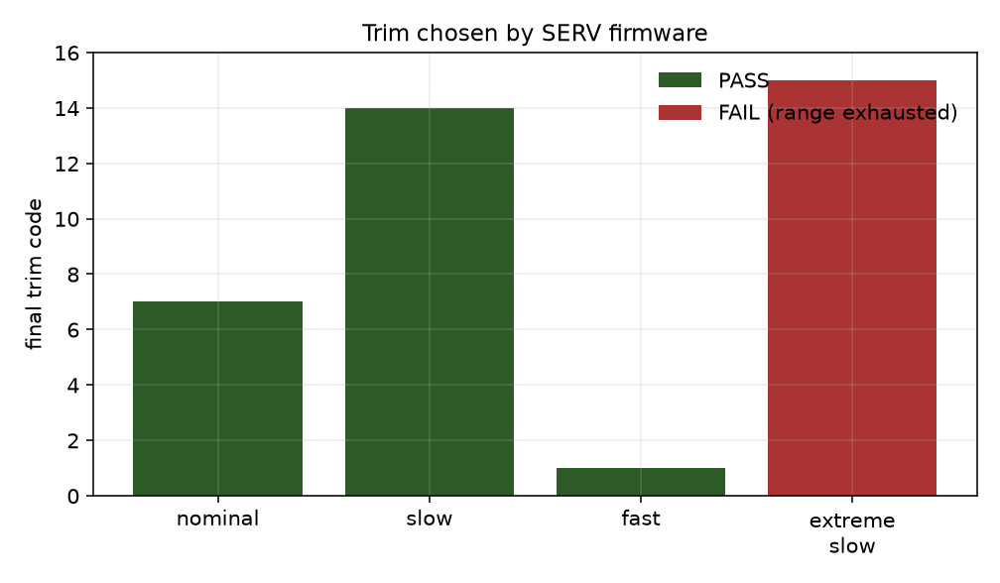

# SERV firmware calibrating a SPICE DCO

This example is a mixed-signal loop with firmware in the middle.

A SERV RISC-V core, simulated as RTL, runs a small RV32I binary. That binary
talks to an MMIO peripheral, turns a transistor-level oscillator on for a short
window, counts edges, and binary-searches a 4-bit trim. SpiceBind implements
the empty `dco_core` HDL module with ngspice. Cocotb chooses the analog
condition and reads the firmware PASS/FAIL flags.

The same HEX image is used for every analog condition. Slow silicon-like
settings need a high trim. Fast settings need a low trim. One condition is
built so that even trim 15 is too slow, and the firmware reports range
exhaustion.

The generated SERV RTL and firmware HEX are committed under `generated/`.

```bash
pytest -v examples/serv_dco_calibration                # Icarus Verilog (default)
SIM=verilator pytest -v examples/serv_dco_calibration
```

## Why it is split this way

A full-chip transistor netlist of SERV plus RAM would be slow and would not
add much to the story. The interesting analog block is the oscillator: it
generates future HDL edges on its own, its frequency depends on voltage,
temperature and MOS parameters, and firmware is the right place to close the
loop.

So the partition is:

- RTL: SERV, register file, RAM, Wishbone interconnect, MMIO, measurement FSM,
  edge counter
- SPICE: only `dco_core` (enable, 4-bit trim, `osc` output)
- Python: corner selection, netlist render, logging, PASS/FAIL check

The DCO is enabled only while a measurement is in progress. Leaving a 100 MHz
ring running for the whole firmware execution would waste analog time.

## Block diagram




## What happens in one test



1. pytest renders `spice/dco.cir.in` for one entry in `corners.py` (VDD,
   temperature, MOS include, load capacitance).
2. The HDL simulator (Icarus Verilog or Verilator) loads `generated/serv_rtl.v`, the local RTL, and either the empty
   `dco_core` (SPICE tests) or `dco_core_beh.v` (bring-up).
3. VPI (`spicebind_vpi`) binds `top.u_dco`. Verilog inputs become
   `Vname … external` sources. Node `osc` is read back as `v(osc)` and driven
   onto the HDL output.
4. SERV fetches from address 0. `simple_ram` is loaded from
   `generated/firmware.hex`.
5. `fw/calibrate.c` searches trim codes toward a count of 32 (tolerance 6).
   Each START pulse runs the hardware sequence idle → warmup → measure →
   settle.
6. Firmware writes `FW_RESULT` and spins. Cocotb logs each `trim → count`
   sample and checks the expected PASS/FAIL for that corner.

The first test, `test_dco_smoke.py`, skips SERV entirely: it drives
`enable`/`trim` from cocotb and waits for rising edges on `osc`. That is the
check that a SPICE oscillator can produce HDL events without the testbench
toggling the output.

## Firmware and MMIO

`fw/calibrate.c` is freestanding RV32I (`-march=rv32i -mabi=ilp32`, no C
library, no `printf`). The algorithm is a 4-bit binary search plus one
confirmation measurement. If the confirmation count varies, firmware keeps the
sample closer to the target.

```c
/* fw/calibrate.c — search trim 0..15 toward TARGET=32, tolerance 6 */

static unsigned measure(unsigned trim)
{
    wr(DCO_TRIM, trim);
    wr(DCO_CTRL, 1u);
    while ((rd(DCO_STATUS) & 1u) != 0u) { /* BUSY */ }
    while ((rd(DCO_STATUS) & 2u) == 0u) { /* wait DONE */ }
    return rd(DCO_COUNT);
}

int main(void)
{
    int lo = 0, hi = 15;
    int best_trim = 8, best_err = 1000, best_count = 0;

    while (lo <= hi) {
        int trim = (lo + hi) >> 1;
        int count = (int)measure((unsigned)trim);
        int err = abs_diff(count, TARGET);
        if (err < best_err) {
            best_err = err;
            best_trim = trim;
            best_count = count;
        }
        if (count < TARGET)
            lo = trim + 1;
        else
            hi = trim - 1;
    }

    int last_count = (int)measure((unsigned)best_trim);
    if (abs_diff(best_count, TARGET) < abs_diff(last_count, TARGET))
        last_count = best_count;

    unsigned result = 1u; /* FINISHED */
    result |= ((unsigned)best_trim & 0xfu) << 8;
    if (abs_diff(last_count, TARGET) <= TOL)
        result |= 2u; /* PASS */
    else if ((best_trim == 15 && last_count < TARGET) ||
             (best_trim == 0 && last_count > TARGET))
        result |= 4u; /* RANGE_EXHAUSTED */
    wr(FW_RESULT, result);
}
```

Higher trim disconnects switched capacitance, so the ring runs faster. A count
below 32 means "too slow → raise trim"; a count above 32 means "too fast →
lower trim".

| Address      | Register        | Meaning                                                    |
|--------------|-----------------|------------------------------------------------------------|
| `0x40000000` | `DCO_TRIM`      | bits `[3:0]`                                               |
| `0x40000004` | `DCO_CTRL`      | bit 0 `START`                                              |
| `0x40000008` | `DCO_STATUS`    | bit 0 `BUSY`, bit 1 `DONE`                                 |
| `0x4000000C` | `DCO_COUNT`     | rising edges in the last window                            |
| `0x40000010` | `FW_RESULT`     | bit 0 finished, bit 1 pass, bit 2 range exhausted, `[15:8]` final trim |
| `0x40000014` | `FW_FINAL_COUNT`| count used for the pass/fail decision                      |
| `0x40000018` | `FW_ITERATIONS` | number of measurements                                     |


## Analog block

`dco_core` is an empty Verilog module. The netlist in `spice/dco.cir.in` is a
5-stage CMOS ring with a NAND enable and binary-weighted switched capacitors.
Higher trim disconnects load, so frequency rises. Startup uses `.ic` on two
ring nodes plus `.tran … uic`. Models are generic BSIM 3.3 (`level=49`), not a
foundry PDK.

```verilog
module dco_core (
    input        enable,
    input  [3:0] trim,
    output       osc
);
endmodule
```

Digital `1` is driven as `VCC` from the selected corner (2.6–3.3 V here).
SpiceBind thresholds default to `0.3*VCC` / `0.7*VCC`, so they move with the
analog supply.

The analog conditions in `corners.py` are synthetic PVT-like demonstration
settings, not foundry corners.

## Generated artifacts

Normal `pytest` does not clone SERV, start Docker, or invoke a RISC-V
compiler. Those outputs are committed:



| File | Role |
|---|---|
| `generated/serv_rtl.v` | Concatenated SERV / servile RTL at the pinned commit. |
| `generated/firmware.hex` | 32-bit little-endian words for `$readmemh`. Padded to the RAM depth. |
| `generated/firmware.lst` | `objdump` listing for debugging. |
| `generated/manifest.json` | SERV commit, container image tag, `march`/`mabi`, content hashes. |
| `rtl/serv_rf_ram.v` | Copy of the upstream RAM file for layout. Simulation compiles it from `serv_rtl.v`; do not add both to the same `iverilog` or Verilator command. |

Rebuild with a local RISC-V GCC if one is on `PATH`, otherwise with the pinned
[IIC-OSIC-TOOLS](https://github.com/iic-jku/IIC-OSIC-TOOLS) image:

```bash
pytest -v examples/serv_dco_calibration --regen-assets
# or
python3 examples/serv_dco_calibration/tools/regenerate.py
```

`--check-assets` writes the same files into a temp directory and compares them
to `generated/` without modifying the tree.

SERV is pinned to `f200eb2ed7b69ac1c6b8eddd47654522aeee5ce8`. The core is
width 1, RV32I, no compressed instructions, no M, no extra CSRs. The container
tag is `docker.io/hpretl/iic-osic-tools:2026.07`.

Docker or Podman is a **build-time** tool for this example, not part of the
normal simulation path.

## Running it

```bash
pytest -v examples/serv_dco_calibration                # Icarus Verilog (default)
SIM=verilator pytest -v examples/serv_dco_calibration
```

| Test | What it runs |
|---|---|
| `test_dco_smoke` | Empty `dco_core` + SPICE. Enable off: `osc` stuck. Enable on: eight HDL rising edges. |
| `test_serv_dco_behavioral` | SERV + firmware + Verilog DCO. Checks the CPU/MMIO/search path without ngspice. |
| `test_serv_dco[nominal/slow/fast/extreme_slow]` | Same firmware, transistor DCO, four analog conditions. |

A full run is about four minutes on a typical laptop. The smoke test and
behavioral bring-up are a couple of seconds. Each SPICE corner is around
45–60 s, dominated by lock-step analog time, not by SERV instruction count.

## Results

These numbers come from one local run of the committed tests. They will move a
little with ngspice version and analog startup variation. The qualitative
pattern is the point: three passing conditions pick different trims, and the
extreme condition fails at trim 15.

| Case | VDD / temp | First count | Final trim | Final count | Firmware |
|---|---|---|---|---|---|
| behavioral | n/a | 34 | 7 | 34 | PASS |
| nominal | 3.3 V / 27 C | 30 | 7 | 30 | PASS |
| slow | 3.2 V / 100 C | 8 | 14 | 34 | PASS |
| fast | 3.3 V / 0 C | 47 | 1 | 33 | PASS |
| extreme slow | 3.0 V / 125 C | 4 | 15 | 21 | FAIL |


The orange line is the firmware target (32 edges in the measure window).
Extreme slow never reaches it.



After a local pytest run you can rebuild the figures from `results/serv_dco.csv`:

```bash
python3 examples/serv_dco_calibration/tools/plot_results.py
```

matplotlib is already a SpiceBind `[dev]` extra. It is not required to run the
tests. The script writes `figures/serv_dco_counts.png` and
`figures/serv_dco_trims.png` (the images above) plus copies under `results/`.

Dumping the raw file is opt-in. Default pytest does not write it.

```bash
SPICE_DUMP_RAW=1 pytest -v examples/serv_dco_calibration/test_serv_dco.py -k test_serv_dco
python3 examples/serv_dco_calibration/tools/plot_osc.py
```

`dump.raw` lands in `sim_build/serv_<corner>/` (gitignored).

## Limitations

- MOS models are generic BSIM3 files in the example. Voltage and temperature
  settings are demonstration conditions, not foundry corners.
